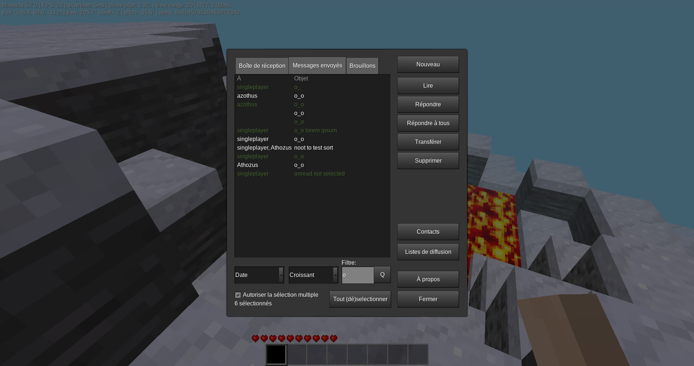

Mail mod for Minetest (ingame mod)
======

This is a fork of cheapies mail mod

It adds a mail-system that allows players to send each other messages in-game and via webmail (optional)

# Screenshot

# Installation

## In-game mail mod

Install it like any other mod: copy the directory `mail_mod` to your "worldmods" folder or use the [contentdb](https://content.minetest.net)

## Webmail

To provide a web-based interface to receive/send mails you can use the [mtui](https://github.com/minetest-go/mtui) project

# Commands/Howto

To access your mail click on the inventory mail button or use the "/mail" command
Mails can be deleted, marked as read or unread, replied to and forwarded to another player

# Compatibility / Migration

Overview:
* `v1` all the data is in the `<worldfolder>/mails.db` file
* `v2` every player has its own (in-) mailbox in the `<worldfolder>/mails/<playername>.json` file
* `v3` every player has an entry in the `<playername>` modstorage (inbox, outbox, contacts)

# Dependencies
* None

# License

See the "LICENSE" file

# Textures
* textures/email_mail.png (https://github.com/rubenwardy/email.git WTFPL)

# Contributors

* Cheapie (Initial idea/project)
* Rubenwardy (Lua/UI improvements)
* BuckarooBanzay (Clean-ups, Refactoring)
* Athozus (Outbox, Maillists, UI, Drafts)
* SX (Various fixes, UI)
* fluxionary (Minor fixups)
* Toby1710 (UX fixes)
* Peter Nerlich (CC, BCC)
* Emojigit (Chinese translation)
* Niklp09 (German translation)
* Dennis Jenkins (UX fixes)
* Thomas Rudin (Maintenance)
* imre84 (UI fixes)
* Chache (Spanish translation)
* APercy (Brazilian Portuguese translation)
* Nuno Filipe Povoa (mail_notif.ogg - https://invent.kde.org/plasma/oxygen-sounds/-/blob/master/sounds/Oxygen-Im-Nudge.ogg)

# Contribute

You can contribute by :
* Reporting an issue
* Give a review on Content DB
* Adding new features
* Fixing an issue
* Translate into a new language
* Add documentation
* ...

You're encouraged to create a fork of this repo, then make your changes and create a pull request when it's done. If you do so, please also check "Git branches" section.

# Git branches

* master : main branch, where are pushed releases and tags
* dev : for new release works, A.B.C release to A.B+1.0
* A.B.X : for fix releases (no new features), A.B.C release to A.B.C+1

For a new fix release (A.B.C) : merge A.B.X branch to master
For a new release (A.B+1.0) : merge dev to master, with previous A.B.C merges (include fixes in master, prioritize dev branch in case of conflicts)

# Old/Historic stuff
* Old forum topic: https://forum.minetest.net/viewtopic.php?t=14464
* Old mod: https://cheapiesystems.com/git/mail/
