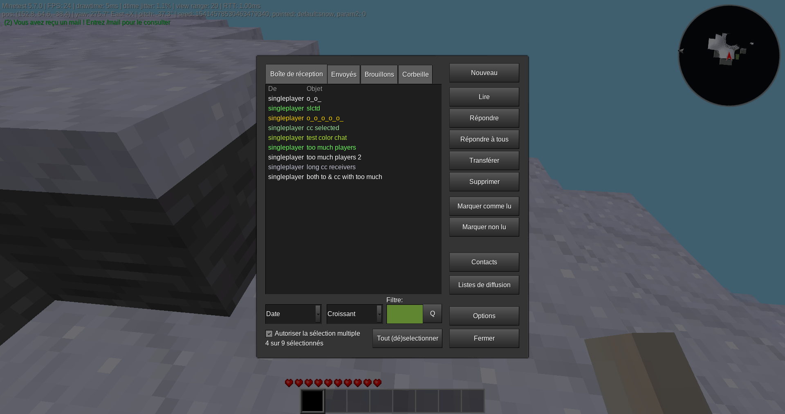

Mail mod for Minetest (ingame mod)
======

This is a fork of @cheapie's mail mod.

It adds a mail-system that allows players to send each other messages in-game and via webmail (optional).

# Screenshot

# Installation

## In-game mail mod

Install it like any other mod: copy the directory `mail_mod` to your "worldmods" folder or use the [ContentDB](https://content.minetest.net)

## Webmail

To provide a web-based interface to receive/send mails you can use the [mtui](https://github.com/minetest-go/mtui) project.

# Commands/Howto

To access your mail type `/mail` command or click on the mail button in your inventory (`unified_inventory`).

Mails can be deleted, marked as read or unread, replied to and forwarded to another player. You can also manage your contacts and your mailing lists.

# Features

* Inbox page
* Outbox page
* Saved drafts
* Read/unread marks
* To/Cc/Bcc system
* Intuitive UI
* Contacts book
* Mailing lists
* Sorters/filters (new in 1.1.0)
* Multiple selection (new in 1.1.0)
* Settings
* Chat, on join, HUD and sound notifications
* Translated in : English, French, German, Chinese (both traditional and simplified), Spanish, Brazilian Portuguese.

# Compatibility / Migration

Overview:
* `v1` all the data is in the `<worldfolder>/mails.db` file
* `v2` every player has its own (in-) mailbox in the `<worldfolder>/mails/<playername>.json` file
* `v3` every player has an entry in the `<playername>` `mod_storage/` (inbox, outbox, drafts, contacts, mailing lists, settings)

# Dependencies
* None

# License

See the "LICENSE" file

# Textures
* textures/email_mail.png (https://github.com/rubenwardy/email.git WTFPL)

# Contributors / Credits

* Cheapie (Initial idea/project)
* Rubenwardy (Lua/UI improvements)
* BuckarooBanzay (Clean-ups, Refactoring)
* Athozus (Outbox, Maillists, UI, Drafts, Trash, Settings)
* SX (Various fixes, UI)
* fluxionary (Minor fixups)
* Toby1710 (UX fixes)
* Peter Nerlich (CC, BCC)
* Emojigit (Traditional Chinese translation)
* Niklp09 (German translation)
* Dennis Jenkins (UX fixes)
* Thomas Rudin (Maintenance)
* imre84 (UI fixes)
* Chache (Spanish translation)
* APercy (Brazilian Portuguese translation)
* Nuno Filipe Povoa (mail_notif.ogg - https://invent.kde.org/plasma/oxygen-sounds/-/blob/master/sounds/Oxygen-Im-Nudge.ogg)
* TheTrueBeginner (Simplified Chinese translation)
* nyomi (Hungarian translation)
* whosit (UI fixes)
* Wuzzy (German translation)
* Muhammad Rifqi Priyo Susanto (Indonesian translation)

# Contribute

You can contribute by :
* Reporting an issue : Go to the [Issues](https://github.com/mt-mods/mail/issues) tab, click on the button **New issue** and type a short title then give many informations (Minetest version, tab where the bug occured, steps to reproduce the crash, etc.)
* Give a review on ContentDB : [Just write ;)](https://content.minetest.net/packages/mt-mods/mail/review/)
* Requesting new features : [Open an issue](https://github.com/mt-mods/mail/issues) and indicate what you need more in details.
* Adding those new features : [Open a pull request](https://github.com/mt-mods/mail/pulls), and if issue(s) are linked, ping them (#number).
* Fixing an issue : Same as before, open a pull request.
* Translate into a new language : copy `locale/template.txt` into `locale/mail.<codelang>.tr`, and add translated strings (syntax : `not translated=translated`). Then, open a pull request. We're also working on opening a [Weblate](https://weblate.org) (free web interface) to translate strings easier.
* Add documentation : adds `.md` (markdown) or `.txt` files and open a pull request.
* ...

You're encouraged to create a fork of this repo, then make your changes and create a pull request when it's done. ~~If you do so, please also check "Git branches" section.~~ (obsolete). Request for merging into `master`, if needed we will push into another branch.

If you don't have a GitHub account, you can also contact maintainers to add manually your contributions.

# Git branches

***Caution : might be obsolete***

* master : main branch, where are pushed releases and tags
* dev : for new release works, A.B.C release to A.B+1.0
* A.B.X : for fix releases (no new features), A.B.C release to A.B.C+1

For a new fix release (A.B.C) : merge A.B.X branch to master
For a new release (A.B+1.0) : merge dev to master, with previous A.B.C merges (include fixes in master, prioritize dev branch in case of conflicts)

# Old/Historic stuff
* Old forum topic: https://forum.minetest.net/viewtopic.php?t=14464
* Old mod: https://cheapiesystems.com/git/mail/
