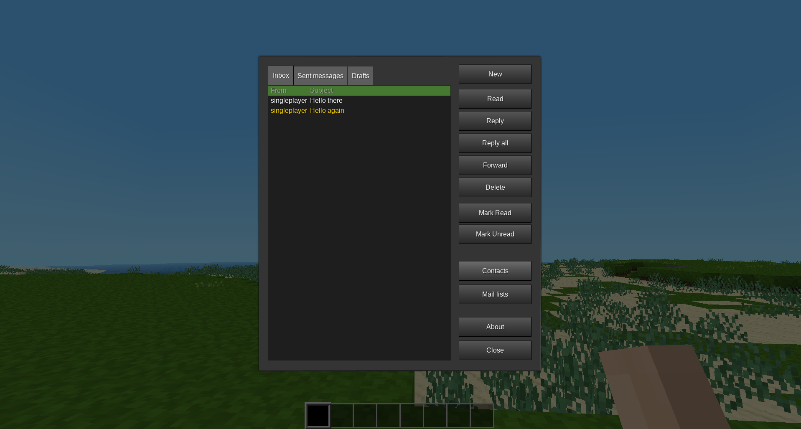

Mail mod for Minetest (ingame mod)
======

This is a fork of cheapies mail mod

It adds a mail-system that allows players to send each other messages in-game and via webmail (optional)

# Screenshot

# Installation

## In-game mail mod

Install it like any other mod: copy the directory `mail_mod` to your "worldmods" folder or use the [contentdb](https://content.minetest.net)

## Webmail

To provide a web-based interface to receive/send mails you can use the [mtui](https://github.com/minetest-go/mtui) project

# Commands/Howto

To access your mail click on the inventory mail button or use the "/mail" command
Mails can be deleted, marked as read or unread, replied to and forwarded to another player

# Compatibility / Migration

Overview:
* `v1` all the data is in the `<worldfolder>/mails.db` file
* `v2` every player has its own (in-) mailbox in the `<worldfolder>/mails/<playername>.json` file
* `v3` every player has an entry in the `<playername>` modstorage (inbox, outbox, contacts)

# Dependencies
* None

# License

See the "LICENSE" file

# Textures
* textures/email_mail.png (https://github.com/rubenwardy/email.git WTFPL)

# Contributors

* Cheapie (initial idea/project)
* Rubenwardy (lua/ui improvements)
* BuckarooBanzay (cleanups, refactoring)
* Athozus (outbox, maillists, ui fixes)
* fluxionary (minor fixups)
* SX (various fixes)
* Toby1710 (ux fixes)
* Peter Nerlich (cc, bcc)

# Old/Historic stuff
* Old forum topic: https://forum.minetest.net/viewtopic.php?t=14464
* Old mod: https://cheapiesystems.com/git/mail/
